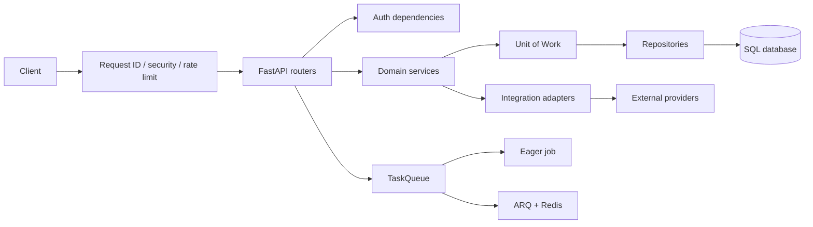

# Архитектура TaskFlow

## Цели

TaskFlow разделяет HTTP API, бизнес-операции, хранение данных, фоновые jobs и внешние вызовы. Это позволяет запускать проект локально на SQLite без Redis и постепенно добавлять PostgreSQL, Redis, S3, Meilisearch, MongoDB и внешних providers.

## Общий поток запроса



## Слои кода

### HTTP и application lifecycle

- `app/main.py` создаёт FastAPI app, middleware, OpenAPI и admin sub-application.
- Lifespan создаёт общий `httpx.AsyncClient`, инициализирует схему, data clients, resilient client, storage и integration services.
- При shutdown останавливаются scheduler, broker, queue, data clients и HTTP client.
- `app/api/v1/router.py` собирает доменные routers под `/api/v1`.

### Core

- `app/core/config.py` — typed settings из `.env`.
- `app/core/security.py` — JWT, refresh tokens, CSRF и API key principals.
- `app/core/deps.py` — FastAPI dependencies для DB, Unit of Work и scopes.
- `app/core/middleware.py` — request id, timing, access log, gzip, rate limit и security headers.
- `app/core/errors.py` — единый `DomainError` contract для API-ошибок.

### API и services

- `app/api/v1/users.py`, `auth.py`, `tasks.py`, `teams.py` — базовые пользовательские и task flows.
- `app/api/v1/jobs.py`, `ws.py`, `system.py` — фоновые процессы, realtime и health endpoints.
- `app/api/v1/files.py`, `webhooks.py`, `llm.py`, `payments.py` — внешние integration flows.
- `app/services/tasks.py`, `teams.py`, `users.py` содержат бизнес-операции и преобразование ORM-моделей в schemas.
- `app/schemas/` задаёт Pydantic-контракты, валидацию и response models.

### Data access

- `app/db/session.py` содержит async engine и `async_session_maker`.
- `app/db/models.py` содержит ORM-модели.
- `app/repositories/` инкапсулирует SQL-запросы.
- `app/db/uow.py` собирает repositories на одной `AsyncSession`.
- Request dependency `get_db` коммитит успешный запрос и делает rollback при исключении.
- Background jobs создают собственные sessions и не используют request-scoped session.

Основные таблицы:

| Таблица | Назначение |
| --- | --- |
| `teams` | команды |
| `tasks` | задачи и внешние идентификаторы |
| `task_attachments` | небольшие task attachments в БД |
| `task_events` | task event log |
| `outbox_events` | transactional outbox |
| `webhook_events` | сырые inbound events и deduplication key |
| `webhook_deliveries` | история outbound deliveries |
| `payments` | локальное состояние Stripe Checkout |

Схема версионируется в `alembic/versions/`. Для deployment используйте `alembic upgrade head`.

## Фоновые задачи и realtime

`app/workers/queue.py` предоставляет единый `TaskQueue`:

```text
REDIS_URL отсутствует  -> eager TaskQueue -> JobStore в памяти
REDIS_URL доступен      -> ARQ pool -> Redis queue -> отдельный worker
```

Job handler получает `JobContext` с `job_id`, progress reporter, Redis и broker. Зарегистрированные jobs находятся в `app/workers/jobs.py`:

- `generate_report`;
- `relay_outbox`;
- `purge_published_outbox`;
- `send_welcome_email`;
- `process_webhook_event`;
- `deliver_webhook`.

Outbox relay публикует события в broker и помечает их `published_at`. При падении между publish и commit возможна повторная публикация — это ожидаемая at-least-once семантика.

WebSocket manager работает локально в процессе. Если Redis доступен, `EventBroker` добавляет cross-instance Pub/Sub.

## Resilient HTTP и integrations

`app/integrations/http.py` оборачивает один долгоживущий `httpx.AsyncClient`:

- timeout разделён на connect/read/write/pool;
- retry применяется к transient exceptions и retryable status codes;
- небезопасные POST повторяются только при переданном `Idempotency-Key`;
- учитывается `Retry-After`;
- для каждого `breaker_name` работает отдельный circuit breaker.

`app/integrations/runtime.py` создаёт сервисы и выбирает app-state instance или module-level fallback для тестов и eager jobs.

### Files

`app/storage/base.py` задаёт общий интерфейс. `LocalFileStorage` хранит bytes и metadata sidecar в `STORAGE_LOCAL_DIR`, а `S3Storage` использует optional `aioboto3`. Upload token включает key, content type, max size и expiry и подписывается HMAC.

### Webhooks

Raw body проверяется до JSON parsing. После проверки event сохраняется с уникальной парой `source + external_id`, затем job ставится в очередь. Stripe status events обновляют `payments.status`.

Outbound delivery сериализует payload компактно, подписывает HMAC и отправляет через resilient client. Результат сохраняется независимо от success/failure upstream.

### Email

`EmailService` использует provider-agnostic JSON contract:

```json
{
  "from": "TaskFlow <no-reply@example.com>",
  "to": ["user@example.com"],
  "subject": "Welcome to TaskFlow",
  "text": "...",
  "html": "..."
}
```

Если `EMAIL_PROVIDER_BASE_URL` или `EMAIL_API_KEY` отсутствуют, job не делает network call и возвращает `skipped`.

### Stripe

`StripeService` отправляет form-encoded `POST /v1/checkout/sessions`, передаёт bearer API key и idempotency key, а локальную запись создаёт через `PaymentRepository`. Реальный переход payment в `paid` выполняется только через подписанный webhook.

### LLM

`LLMService` вызывает Anthropic Messages API raw HTTP streaming endpoint, парсит SSE text deltas и ограничивает concurrency semaphore. Без API key включается deterministic offline fallback для локальной разработки.

## Storage и ownership

Upload key имеет формат `uploads/{user_id}/{random_id}/{filename}`. Confirm и download проверяют, что key принадлежит текущему пользователю; администратор может читать любой key. Local upload token сам является credential и не требует bearer auth.

## Ошибки и безопасность

Все доменные ошибки проходят через `DomainError` handler и получают форму:

```json
{
  "error": {
    "code": "invalid_signature",
    "message": "..."
  },
  "request_id": "..."
}
```

Критичные правила:

- webhook signature проверяется по raw bytes;
- duplicate webhook не запускает повторную обработку;
- retry небезопасного POST невозможен без idempotency key;
- upload token ограничивает размер, MIME type и срок действия;
- payment status не принимается из frontend redirect как источник истины;
- секреты берутся из environment, а не из кода.

## Ограничения текущей реализации

- Пользователи сейчас хранятся в in-memory service (`app/services/users.py`), поэтому production user persistence ещё требует отдельной DB-модели.
- Старые task attachments хранят bytes в SQL; новый storage adapter предназначен для файлового object storage и не мигрирует их автоматически.
- Email adapter задаёт общий JSON contract, а vendor-specific mapping остаётся ответственностью настроенного email gateway.
- Реальный Stripe, email и S3 integration требуют credentials и сетевой доступ; в CI проверяются adapters через mock transports.
- Mypy настроен в strict mode, но в проекте остаются существующие type issues в нескольких старых модулях.

## Точки расширения

- Добавить provider-specific adapter в `app/integrations/` и собрать его в `runtime.py`.
- Добавить storage backend, реализовав `FileStorage`.
- Добавить job в `JOB_HANDLERS` и зарегистрировать его в `app/workers/settings.py`.
- Добавить доменную операцию в service, repository и Unit of Work без доступа к БД из router.
- Добавить новую Alembic revision с предметным именем и сохранить `down_revision` цепочку.
